# LazyGit 사용법

## LazyGit 이란

- GIT을 사용하기 위해서 여러가지 Tool들이 존재

- 그중에서도 GUI로 유명한것은 Github에서 제공하는 Github-Desktop, GitKraken, Source-Tree이 있다.

- 하지만 TUI(Text-based User Interface)로는 어떤것이 있을까?

- 유명한 것은 `tgi`,`LazyGit`,`gitui`가 존재한다.

- 이번 정리글은 `LazyGit` 사용법에 대해 알아보고자한다.

## LazyGit 화면

### Status 화면

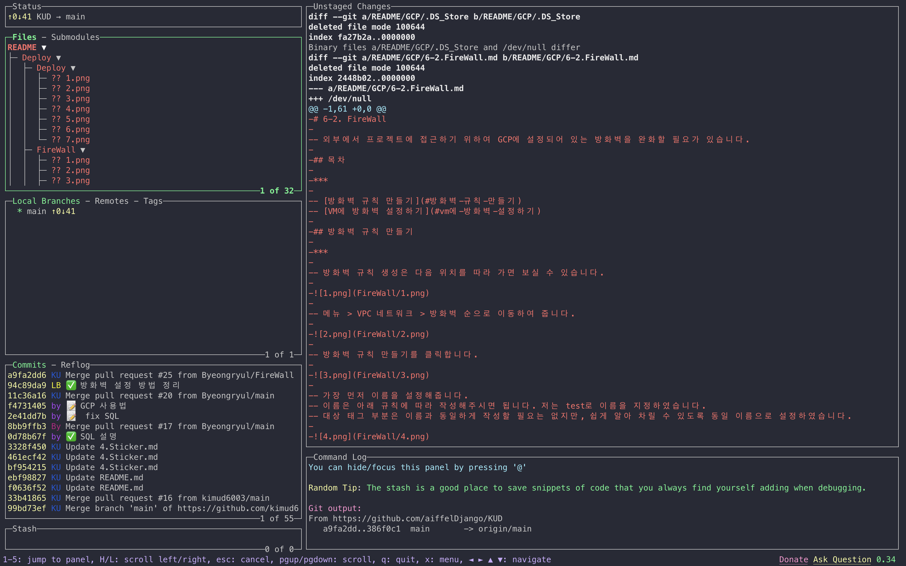

- 왼쪽 상단의 `Status`는 `git status`명령어를 타이핑 했을때 나오는 것과 같습니다.

### Branches-Remotes-Tags 화면

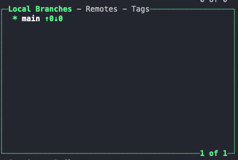

- 두번째 `Local Branches`,`Remote`,`Tags`로 나누어진 페이지가 보이실겁니다.

- `Local Branches`를 누르면 현재 로컬 환경의 브랜치들을 볼수있습니다.

- `Remotes`를 누르면 원격에서 사용되고 있는 브랜치들을 볼수 있습니다.

- `Tags`를 누르면 태그를 볼수 있습니다.

> ### 잠깐 로컬 브랜치랑 리모트 브랜치가 뭔지 모르시겠다구요?!
>
> - 리모트 브랜치는 저장소(github,gitlab ...) 에 있는 브랜치를 의미합니다.
>
> - 따라서 우리는 Remote 브랜치를 통해서 저장소에 어떤 브랜치가 있고 전에 어디까지 진행했는지 알수있게 됩니다.
>
> - Tags는 커밋에 달수 있는 꼬리표로 릴리즈 버전과 같은 내용을 다는데 유용하게 사용합니다.

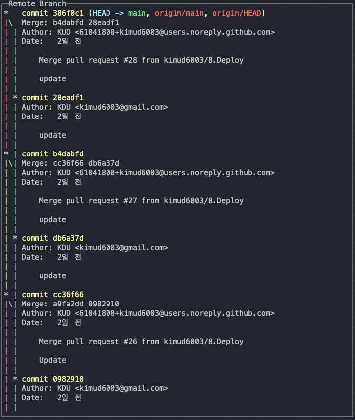

- 각 상황에 맞게 브랜치를 누르면 오른쪽 `git graph`를 볼수 있게 나타납니다.

### Commit-Reflog 화면

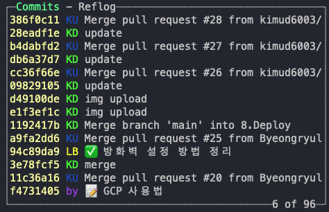

- `Commit`창은 해당 프로젝트에서 커밋할 이력을 모두 보여줍니다.

- 자세한 내용은 오른쪽에서 더욱 자세하게 볼수 있습니다.

  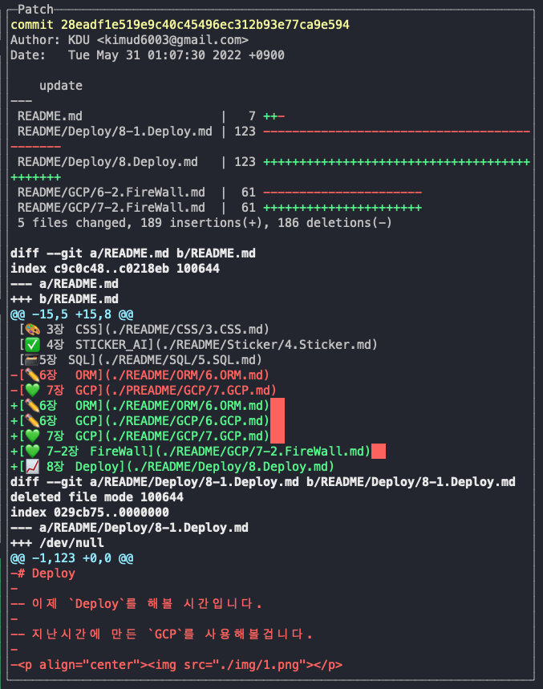

- `Reflog`를 누르게 되면 브랜치나 태그의 모든 변경사항을 볼수 있습니다.

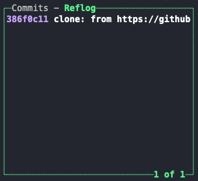

- `Reflog`에 대한 내용 역시 오른쪽 창에서 자세하게 볼수있습니다.

  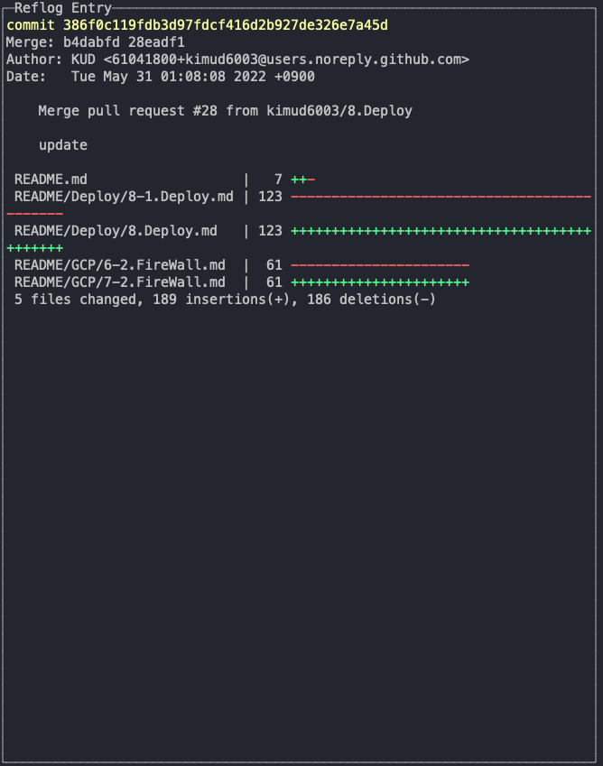

> ### 잠깐 Reflog를 언제 사용하게 될까요?
>
> - 바로 여러분들이 열심히한 Commit이 잘못되거나 Reset을 복구 할때 사용하게 됩니다.

### Stash 화면

- `Stash`는 `git stash save`를 통해 저장된 내용이 담기게 됩니다.

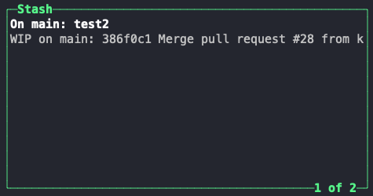

- 자세한 내용은 오른쪽에서 더욱 자세하게 볼수 있습니다.

  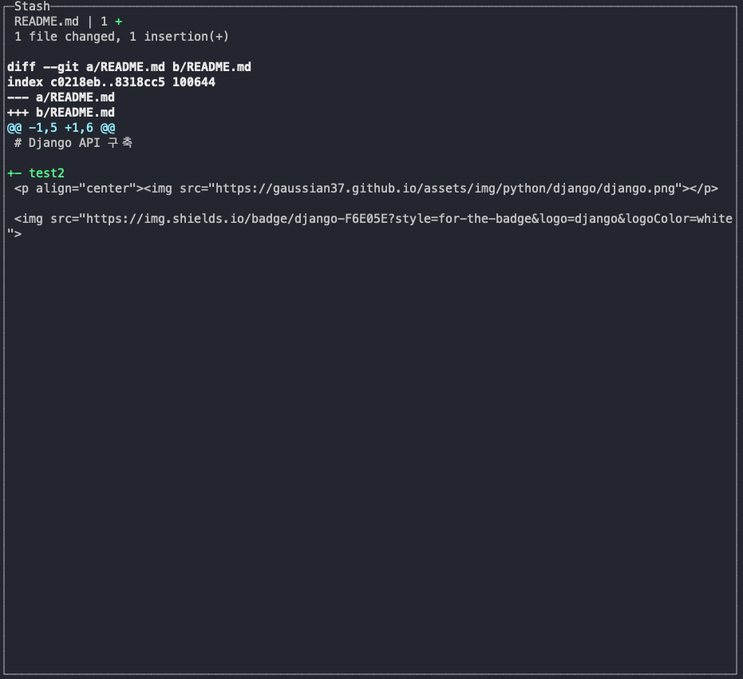

> ### 잠깐 Stash는 또 언제 사용하냐구요?!
>
> 만약 이 글을 읽고 Stash에 대해 알게 된다면 협업을 해본적 없는 거군요 ㅎㅎ
>
> 여러분들이 누군가와 협업을 하고 있는데 갑자기 특정 브랜치의 내용을 수정해달라고 요청을 합니다.
>
> 그래서 `git checkout 특정브랜치`를 할려고 하면 변경사항이 있다고 빼애애액 거립니다.
>
> 그럴때 특정 공간에 잠시 저장 시키고 브랜치로 이동할 필요가 있는데 잠시 저장시키는 공간이 stash라고 생각하시면 됩니다.

## gitlazy commands

- 이번에는 Gitlazy의 커맨드에 대해 배우게 될겁니다.

- `Gitlazy`는 다양한 기능이 있기 때문에 모든 기능을 설명 하지 않을것입니다.

- 하지만 기능은 `x`를 눌러서 확인해 볼수 있기 때문에 궁금하면 눌러서 볼수 있습니다 ㅎㅎ

### Global Commands

- `lazyGit`에 있는 기본적인 커맨드입니다.

```bash

   ctrl+r: 최근 리포지토리로 전환

   pgup: 메인 패널 위로 스크롤(fn+up/shift+k)

   pgdown: 메인 패널 아래로 스크롤(fn+down/shift+j)

   m: 병합/리베이스 옵션

   ctrl+p보기 : 커스텀 패치 옵션 보기

   R: 새로 고침

   x: 메뉴 열기

   +: 다음 화면 모드(일반/반/전체 화면)

   _: 이전 화면 모드

   ctrl+s: 경로별 필터 옵션 보기

   W: diff 메뉴

   ctrl+e열기 : diff 메뉴 열기

   @: 명령 로그 메뉴 열기

   }: diff 보기의 변경 사항 주위에 표시되는 컨텍스트 크기 증가

   {: diff 보기의 변경 사항 주위에 표시되는 컨텍스트 크기 줄이기

   :: 사용자 지정 명령 실행

   z: 실행 취소(reflog를 통해)(실험적)

   ctrl+z: 다시 실행(reflog를 통해)(실험적)

   P: Push

   p: Pull

```

#### File Panel

- 파일 패널에서 자료가 보이게 하기위해 파일을 수정해보았습니다.

- `test.sh`라는 파일을 만들고 안에 `ls`라는 명령어를 타이핑 해보았습니다.

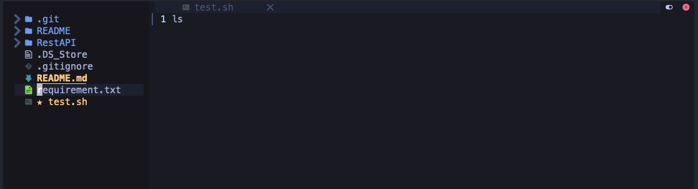

- 이제 `lazygit`명령어를 통해 확인해 보면 아래와 같이 보이게됩니다.

- 빨간색으로 나오면 `add`가 되어있지 않다는 겁니다.

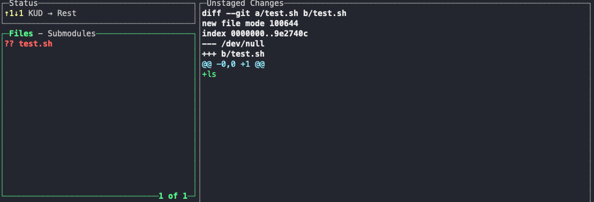

- 이제 아래 명령어들을 통해 `File`패널에 있는 내용을 건드려보도록 하겠습니다.

- 모두 `Git`에 대해서는 잘알고 있겠지만 기본적인 개념을 정리해보도록 하겠습니다.

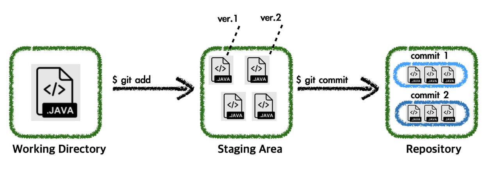

- `Git`의 영역은 크게 3가지로 나눠지게 됩니다.

  - `Working Directory` : 내가 작업하고 있는 프로젝트의 디렉토리

  - `Staging Area` : 커밋을 하기 위해 `git add`명령어로 추가한 파일들이 모여있는 공간

  - `Repository` : 커밋들이 모여있는 저장소

```bash
   space: git add를 해주는 커맨드/ 취소도 역시 space입니다

   c: 커밋하기

   w: 사전 커밋 후크 없이 변경 사항 커밋 (커밋 훅이란 커밋하기 전에 명령을 몇가지 첨부할수 있는것입니다.)

   d: 변경파일 또는 코드를 지우기

   ctrl+o: 파일 이름 복사

   ctrl+b: 파일 필터링으로 스태이징 된것/ 스태이징 되지 않은것들을 필터 형식으로 볼수있습니다.

   A: 현재 수정한 파일을 마지막 커밋에 첨부하기

   o: 파일 열기

   i: .gitignore에 추가

   r: 파일 새로 고침

   s: 모든 변경 사항 숨김

   S: 숨김 옵션 보기

   a: 모두 스테이지/언스테이징

   enter: 파일에 대한 개별 헝크/라인 스테이지 또는 축소/확장 디렉토리

   D: 재설정 옵션 보기

   M: 외부 병합 도구 열기(git mergetool)
```

#### Branch Panel

- `branch`란 독립적으로 어떤 작업을 하기 위한 `개념!`입니다.

- `branch`를 나누어서 동시에 여러 작업을 할수있게 해주는데 `branch 전략`을 통해 다양하게 적용해 볼수있습니다.

- 만약 예를 들어 `test1`이라는 브랜치와 `test2`라는 브랜치가 있다고 가정해봅시다.

- 길동이는 `test1`에서는 `hello.txt` 라는 파일을 만들었다고 가정하겠습니다.

- 둘리는 `test2`에서는 `world.txt`라는 파일을 만들었다 가정하겠습니다.

- 그랬을때 둘리와 길동이는 서로의 브랜치를 합쳐서 `hello.txt`와 `world.txt`가 같은 브랜치에 있도록 만들고 싶다고 하겠습니다.

- 그럼 어떻게 하는게 좋을까요?

- 우선 밑에 있는 그림에서 `experiment`가 `test1`브랜치라고 가정하고, `master`가 `test2`라고 생각해주시면 이해가 잘될겁니다.


- 이 문제의 정답은 두가지가 있는데 `merge`와 `rebase`가 존재합니다.

- `merge`와 `rebase`의 차이를 알아보기 위해서는 말보다는 그림이 편합니다.

- 아래 그림을 보고 먼저 스스로 이해해보는 시간을 가지도록 하겠습니다.

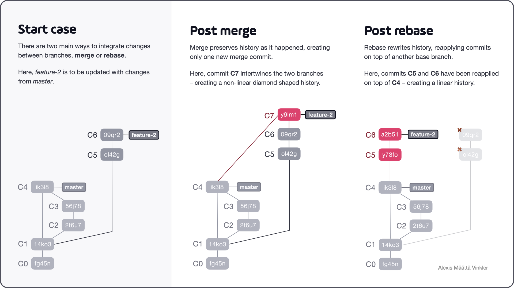

- 자 이제 그럼 확인해보도록 하겠습니다.

- 먼저 `merge`는 몇가지 특징이 있습니다.

  - 병합을 하면 합쳐진 브랜치의 커밋 메시지가 중복으로 쌓이게 됩니다.

  - 커밋 순서를 바꾸지 않습니다.

  - 존재하는 브랜치가 변경되지 않습니다.

  - 새로운 merge commit을 생성합니다.

  - git merge --abort : 병합을 취소하는 명령어

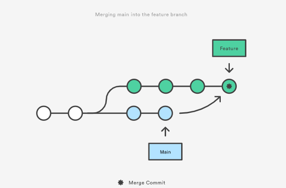

- 그럼 `rebase`는 어떤 특징이 있을까요?

  - 병합을 하면 브랜치의 커밋 메시지가 시간 순서대로 합쳐집니다.

  - 히스토리를 깔끔하게 유지하기 위해 사용합니다.

  - master 브랜치의 기존의 마지막 커밋 뒤에 병합할 브랜치의 커밋들이 합쳐지게 하여 master 브랜치에 재배치(rebase)하게 됩니다

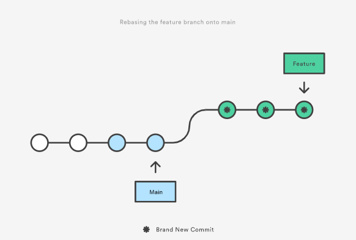

- 이제 위 개념을 가지고 커맨드를 보도록 하겠습니다.

```bash
   ctrl+o: 분기 이름을 클립보드에 복사

   i: git-flow 옵션 표시 (git flow는 여기서 다루지 않지만 여러분들이 알아보시길 권유합니다 ㅎㅎ)

   space: 체크아웃 (해당 브랜치로 옮겨가기)

   n: 새 branch 만들기

   o: pull 요청

   O: pull 요청 옵션 띄우기

   ctrl+y: Pull requset를 요청하는 URL 복사(github에 PR을 하러 가는 페이지를 바로 복사합니다)

   c: 브랜치 이름을 통해 체카웃하기

   F: 강제 체크아웃

   d: 브랜치 삭제

   r : 체크아웃된 브랜치로 rebase 요청

   M: 현재 체크아웃된 브랜치로 병합

   f: 업스트림에서 이 분기를 빨리 감기

   g: reset 옵션 보기 (soft,mix,hard의 차이를 아셔야합니다.)

   R: 브랜치 이름 바꾸기

   u: 업스트림 설정/해제

   enter: 커밋 보기
```

### Remote Panel


- `Remote`저장소는 인터넷이나 네트워크 어딘가에 존재하는 저장소를 의미합니다.

- 여태까지 여러분들이 많이 사용해보셨을 `github`도 `Remote` 저장소입니다.

- 그런데 인터넷은 정보의 바다라고 이야기하는데 우리가 가져온 파일을 저장소에 보내기위해서는 `Git`에게 어떻게 알려주어야 할까요?

- `git`은 `Remote`라는 기능을 통해 저장소의 경로를 저장할수 있습니다.

```bash

  f: 원격에 있는 데이터 가져오기

  n: 원격 저장소 연결하기(만약 사용하는 원격 저장소가 github,gitlab,bitbucket일 경우 여러개 연결도 가능합니다)

  d: 원격 연결 제거

  e: 원격 연결 수정
```

### Tags

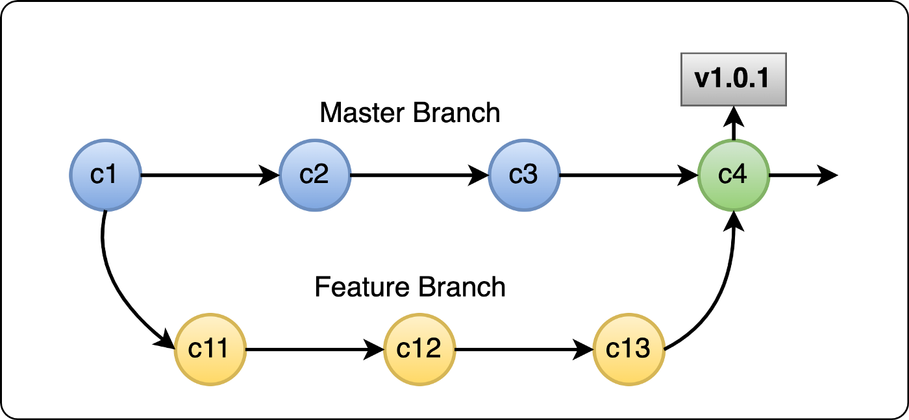

- `Tag` 란 커밋을 참조하기 쉽도록 이름을 붙이는것입니다.

- 태그를 붙여 놓으면 커밋번호를 통해 이동하는것이 아닌 태그명을 통해 간편하게 이동할수 있습니다.

- 나중에 작업을 하다보면 수백 혹은 수천의 `Commit`을 마주하게 될것입니다.

- 그때 가독성있게 사용하기 위해서 `Tags`를 사용하면 좋습니다.

- 하지만 보통 Tag는 소프트웨어의 version `release`를 표현할때 많이 사용합니다.

```bash
  space: 체크아웃

  d: 태그삭제

  P: 원격 저장소에 `push`하기

  n: 태그 만들기

  g: reset 옵션들 보기

  enter: 커밋 이력 보기
```

### Stash Panel

- 어떤 작업을 하던 중에 다른 요청이 들어와 하던 작업을 멈추고 잠시 브랜치를 변경해야 할 일이 있다고 하자. 이때, 아직 완료하지 않은 일을 commit하는 것은 껄끄럽습니다.

- 이때 필요한것이 `git stash`라고 설명했는데 이번엔 그림을 통해 보도록 해보겠습니다.


- `Stash`는 일하고 있던 내용을 잠시 저장하는 공간 정도로 생각하면 좋을거 같습니다.

- 예를 들어 실수로 `main`에서 작업하고 특정 브랜치에서 파일을

```bash
   space: stash한 내용 해당 브랜치에 적용

   g: (pop)stash한 내용 해당 브랜치에 적용(space와 어떤 차이가 있는지 모르겠습니다...)

   d: stash한 내용 버리기

   n: 새 브랜치 만들기

   enter: 선택한 항목의 파일 보기
```

### Commit Panel

- 제 개인적인 생각이지만 `Git` 의 가장 중요한 파트인 `Commit` 입니다.

- 지금 이글을 보고 계신분들이 `commit`을 모르실거라는 생각은 하지 않습니다.

- 하지만 아래 커맨드를 보면 알수 있겠지만 `commit`이외에도 `squash`, `cherry-pick`이라는 용어가 나오게 됩니다.

- `squash` 는 여러번 커밋한 이력을 하나의 커밋 이력으로 만드는데 사용합니다.

- 우리는 `git log`을 통해서 커밋한 이력을 확인할수 있는데 이들을 하나로 만든다는 것이죠 ㅎㅎ

- `squash`의 기능을 사용할려면 `rebase`를 사용해야 합니다.

- 만약 제가 `Hello Commit`, `World Commit`이라는 두개의 커밋을 했는데 이를 하나로 합치고 싶은 상황이라고 하면 어떻게 해야하는지 보여드리겠습니다.

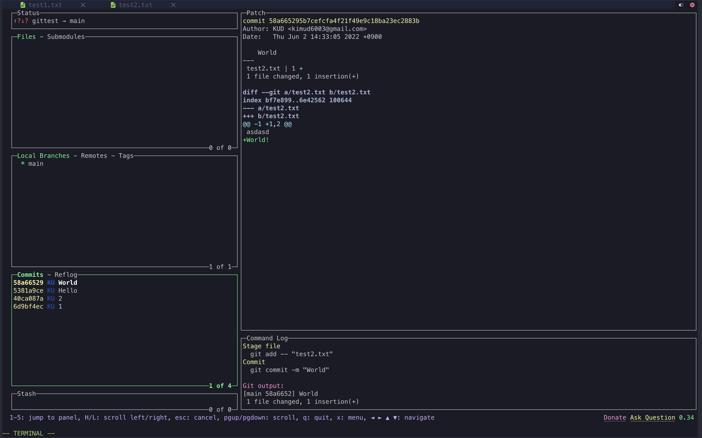

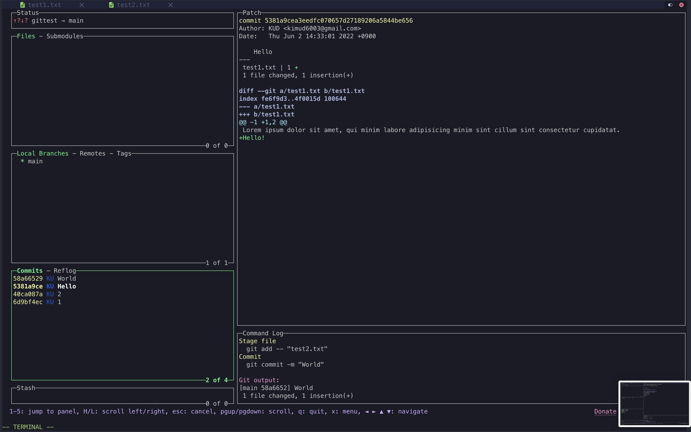

- 두가지의 커밋을 `Hello World` 라는 커밋으로 바꾸어 보도록 하겠습니다.

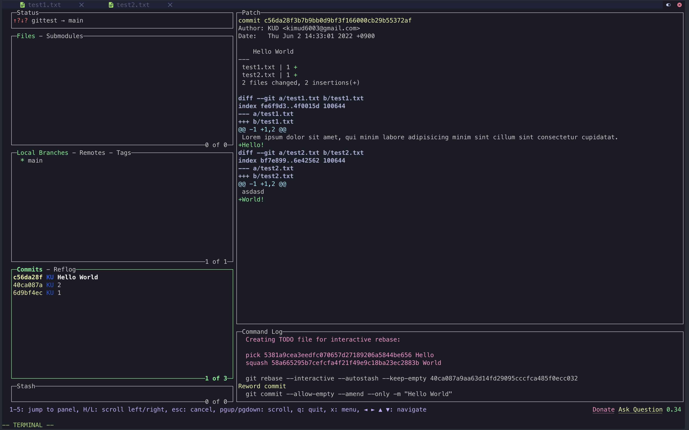

- squash 커밋 메시지

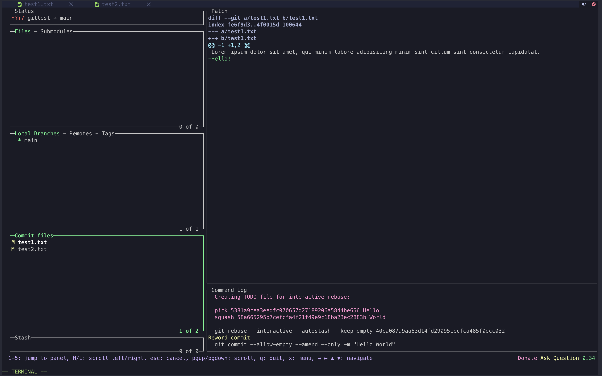
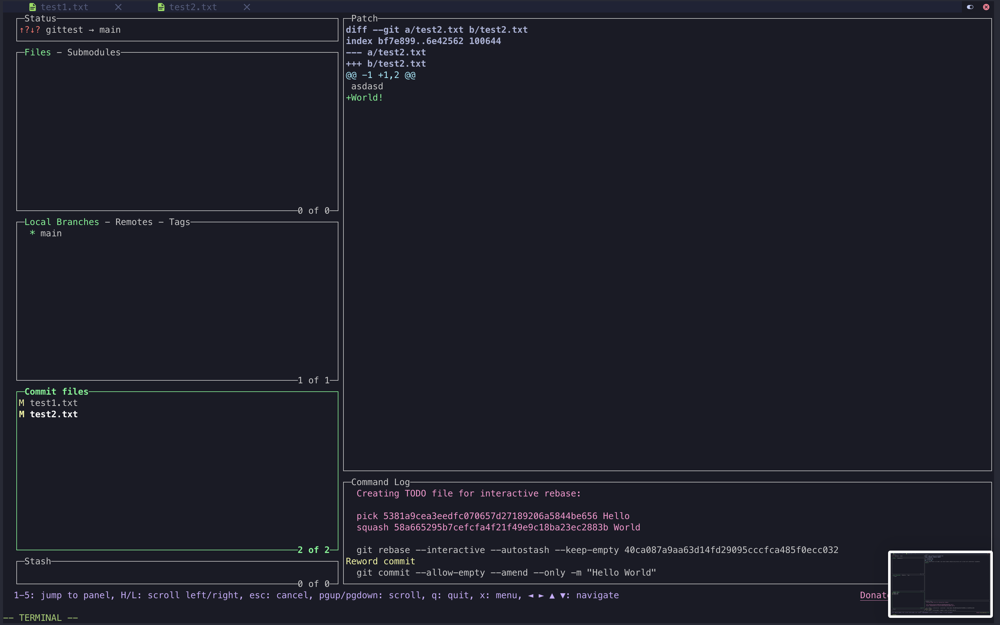

- 명령어로 접근하기 위해서는 `git rebase -i <커밋> <커밋>` 으로 작성하여 수정 해주시면 이렇게 만들수 있습니다.

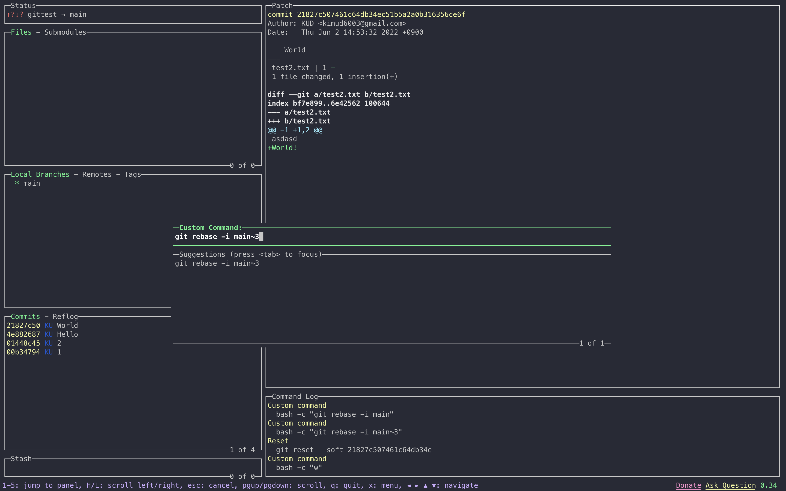

- 해당 명령어를 타이핑 하게 되면 아래와 같은 `vim` 페이지로 넘어가게 됩니다.

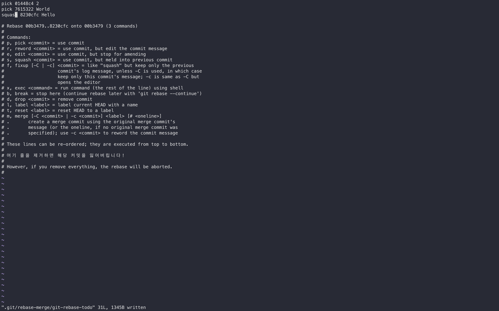

- 여기서는 이전에 있던 커밋들의 로그를 볼수 있습니다.

- `pick` 은 현재 선택된 `commit`들이고 여기서 `squash` 혹은 `fixup` 으로 바꿀수가 있습니다.

  - squash : 원본과 합치는 대상 커밋의 메시지를 결합한 메시지 표시

  ```vim
    pick 7615322 원본 커밋 메세지

    squash 8230cfc 합칠 커밋 메시지

    # squash result

    원본 커밋 메세지

    squash 커밋 메시지
  ```

  - fixup : 원본 유지, 합치는 대상 커밋 메시지 삭제

  ```vim
    pick 7615322 원본 커밋 메세지

    squash 8230cfc 합칠 커밋 메시지

    # fixup result
    원본 커밋 메세지
    # no sub messages
  ```

- 이렇게 하시면 다음창에서 이렇게 나타나게 될겁니다.

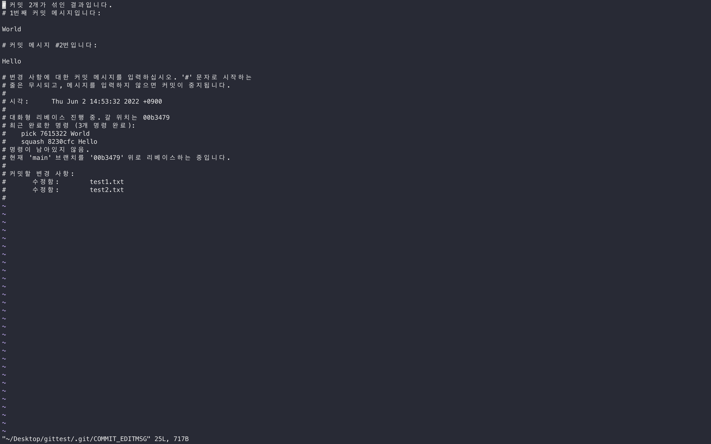


- `cherry-pick`은 다른 브랜치 있는 커밋을 가지고 오고 싶을때 자주 사용합니다.

```bash
   ctrl+o: 커밋 복사

   ctrl+r: 체리 선택(복사)된 커밋 선택 재설정

   b: bisect (bisect는 git에서 버그가 발생하는 지점을 찾기 위해 사용합니다)

   s: 스쿼시 다운 (이전에 있던 커밋하고 합치기)

   f: fixup 하기 (위에서 squash와의 차이를 설명 드렸습니다 )

   r: 커밋 이름 정정

   R: 커밋 수정

   d: 커밋 삭제

   e: 커밋 편집

   p: 커밋 선택(리베이스 중일 때)

   F: 이 커밋에 대한 수정 커밋 생성

   S: 모두 'fixup' 스쿼시 선택한 커밋 위의 커밋(autosquash)

   ctrl+j: 커밋을 하나 아래로 이동

   ctrl+k: 커밋을 하나 위로 이동 :

   v: 커밋 붙여넣기(cherry-pick)

   A: 단계적 변경으로 커밋 수정

   a: 커밋 작성자 재설정

   t: 커밋 되돌리기

   T: 태그 커밋

   ctrl+l: 로그 메뉴 열기

   space: 커밋 체크아웃

   y: 커밋 속성 복사

   o: 브라우저에서 커밋 열기 : 커밋

   n: 새 브랜치 만들기

   g: 재설정 옵션 보기

   c: 커밋 복사(cherry-pick)

   C: 커밋 범위 복사(cherry-pick)

   enter: 선택한 항목의 파일 보기

```

### Reflog

```bash
   ctrl+o: 커밋 SHA를 클립보드에 복사

   space: 커밋 확인

   y: 커밋 속성 복사

   o: 브라우저에서 커밋 열기 : 커밋

   n의 새 분기 생성

   g: 재설정 옵션 보기

   c: 커밋 복사(cherry-pick)

   C: 커밋 범위 복사(cherry-pick)

   ctrl+r: 체리-재설정 선택(복사) 커밋 선택

   enter: 커밋 보기

```
